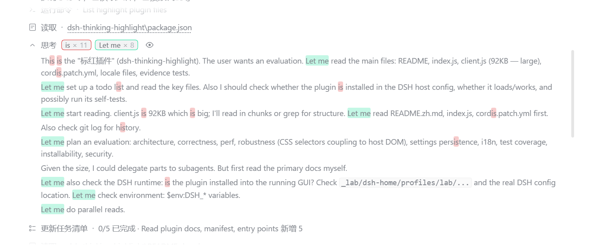
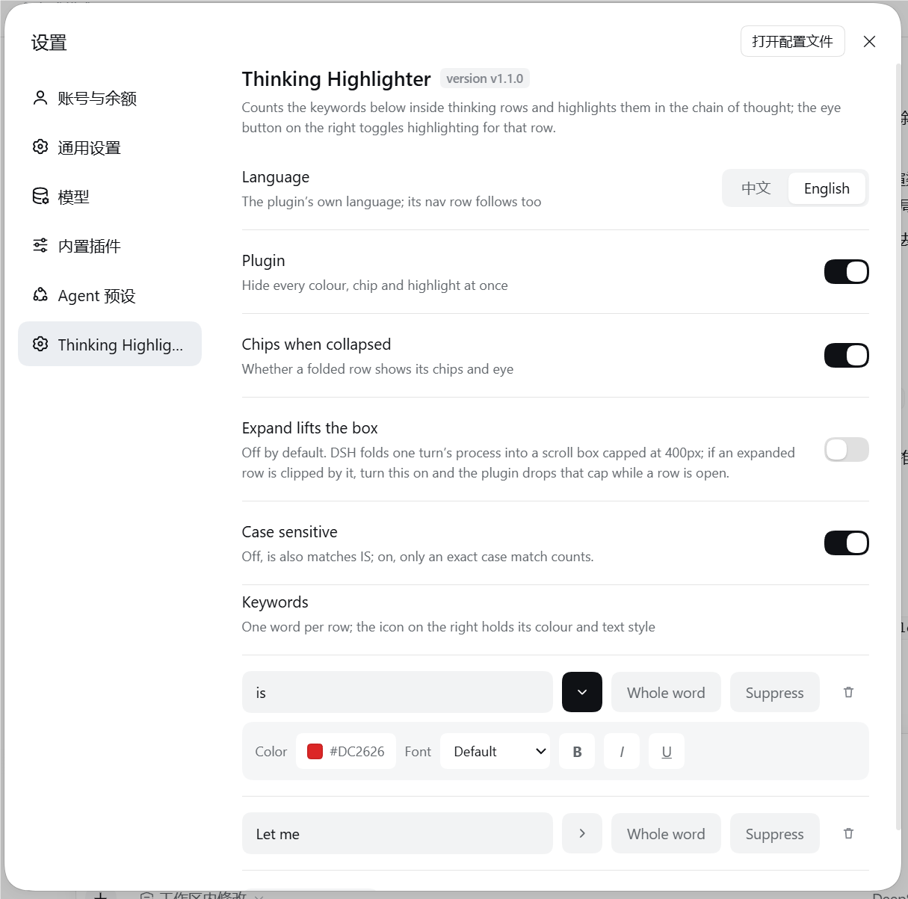

# Thinking Highlighter · 标红插件

A DSH plugin that counts and highlights keywords inside chain-of-thought rows ("thinking" rows), with its own
section in Settings.

[中文说明 →](README.zh.md)



- **Count chips** — every thinking row shows `keyword × n` right after its title, one chip per keyword, so you
  can see at a glance which word keeps coming back and how often.
- **Click a chip to switch that keyword off** — the word stops being highlighted everywhere, the chip stays
  in place in a muted state and the same click turns it back on. The choice is remembered.
- **Highlighting** — expand a row and every occurrence of a keyword is tinted with that keyword's own colour.
- **Per-keyword colour, ink and text style** — the highlight's tint, the words' own text colour (or *Theme*, which
  keeps the host's, so a light/dark flip never leaves a word unreadable), a size on the host's own scale
  (10–22 px, the same range DSH's own content font size uses), typeface (default / monospace / serif), bold,
  italic and underline. What you set is what both the highlight and the chip show, and the chip grows and
  shrinks with its keyword's size.
- **Whole-word matching** — per keyword: `is` either matches everywhere or only where it stands alone
  (never inside `this` or `ThisIs`).
- **Folded rows count the whole chain of thought** — the numbers do not change when you expand a row.
- **Per-row eye** — one row's highlighting can be hidden without touching the others. The marks stay in the
  text while a row is switched off and the stylesheet hides them (tint, text colour, size *and* the keyword's
  own type styling), so switching the eye back on is instant and never leaves another keyword unhighlighted.
- **One row per keyword** — typing a word that already exists is refused, with a note saying why.

## Install

Requires the DSH desktop app (built and tested against `@deepseek-ai/dsh-desktop` 0.2.0-rc.2).

```bash
git clone https://github.com/Yokira404/dsh-thinking-highlight.git
cd dsh-thinking-highlight
node evidence/install.mjs desktop        # or another profile name
```

The installer records a `link:` dependency pointing at the checkout, adds the package to
`dsh.profile.bundles`, and creates a junction under `<profile>/node_modules`. Then **restart the app**: the card
appears in **Plugins → 已安装**, where the switch enables or disables it.

You can also add the folder through the Plugins page's own "add plugin" action, which does the same thing
through pnpm.

> The dependency entry is not optional: the Plugins page only lists a package the profile records as a
> *dependency* (or as a shipped-optional bundle). A package that is merely selected in `dsh.profile.bundles`
> loads fine but gets no card — and therefore no switch.

## Settings

`Ctrl + ,` → **标红插件 / Thinking Highlighter** in the left navigation.



| Row | What it does |
|---|---|
| Language | 中文 / English for the plugin's own UI; the nav row follows it too |
| Plugin | Hides every colour, chip and highlight at once |
| Chips when collapsed | Whether a folded row shows its chips and eye |
| Expand lifts the box (off by default) | DSH folds a turn's process into a scroll box capped at 400px; with this on, an expanded row temporarily drops that cap so a long chain of thought can be read without scrolling inside the box |
| Case sensitive | Off (default): `is` also matches `IS` |
| Keywords | One row per word: text field, `▸ style`, `完整词 / whole word`, suppress, delete |
| ▸ style panel | Tint colour, text colour (**Theme** hands it back to the host), text size (10–22 px stepper), font, **B**old, **I**talic, **U**nderline for that keyword |

Settings live in the browser's `localStorage` and apply immediately.

## How it works

The thinking row is a sealed built-in component with no slot to render into, so the plugin decorates the
rendered DOM instead — by splitting text nodes, never by replacing them:

- Highlighting empties the text node React owns and inserts the plugin's own spans before it. React keeps
  updating the same node, so streaming never breaks or loses text. The one visible seam: between React writing
  a new chunk into that node and the plugin's next pass (at most one 90 ms coalescing window) the previous
  split and the new text are both in the DOM; the pass drops the stale copy and re-marks the new text.
- Work is coalesced on a 90 ms timer, and a row whose text and settings are unchanged is skipped entirely.
- The chip set is inserted *inside the header's own text line*, after the title and its separator: while a row
  is folded that header is a fixed-height box, so anything appended to the block itself would land below it.
  The header block is found by its `[data-disclosure-row]` line, not by being the row's first element: while
  the model is still streaming the host renders a visually-hidden "running" status span before it, and a chip
  set parked in that 1 px box is a chip set nobody can see.
- The expanded chain of thought is looked for *inside* the disclosure block, right after the header line,
  because that is where `DisclosureRow` renders it (`[div[data-disclosure-row], open && children]`). A settled
  row that was never seen streaming has to be found this way too, or expanding it can never highlight anything.
- Nothing in the chip set may shrink (the collapsed preview beside it is `flex: auto`), which is why the chip
  group has a fixed width cap and clips only itself.
- Counting is text-accurate: the chip set is excluded, the highlight spans are not — otherwise the numbers
  would climb by one on every pass, or collapse to zero after the first highlight.
- The per-row eye is a presentation switch, not a filter on the work: a row keeps its marks while it is
  switched off (`[data-dsh-hl="off"]` neutralises them) so that muting a keyword, streaming or a host
  re-render during that time cannot leave the row with nothing to show when the eye comes back on.
- A keyword that asks for no text colour is marked as `color: currentColor` rather than a fixed hex, so
  "follow the theme" needs no second code path — and the eye-off rule has an inherited value to hand back.
- The chip's size rides a `--dsh-th-chip-scale` factor on the chip element; the stylesheet grows the chip's line
  height more slowly than its text and caps it with `--dsh-th-chip-line`, a length the client computes from the
  host's own `--dsh-content-font-delta` — a chip on a collapsed row sits on a header line the host pins to a
  fixed height with `contain: size layout`, where an oversized chip would be clipped instead of read. The
  variable is published on `body`, which is why the cap has to be computed at decoration time: reading it is
  only possible from a node inside the document, and no stylesheet rule of ours is scoped to `body`.
- A folded row has no body to read: the host only mounts the chain of thought while expanded, and the whole
  text lives in the host component's `text` prop. The plugin reaches it through the fiber React attaches to
  every element it created (`__reactFiber$…`); anything unexpected reads as "unavailable" and the DOM text is
  used instead.

## Compatibility and caveats

- The plugin decorates `[data-variant="think"]` rows as DSH renders them today. A DSH release that changes
  those internals can require an update here; when a lookup fails the plugin degrades to doing less, never to
  breaking the transcript. `evidence/host-shape.mjs` models the installed markup and also asserts the markers
  it depends on are still present in the app's own bundle, so a DSH rename fails a test instead of going quiet.
- The 10–22 px size range is not the plugin's own: it is the host theme plugin's content font size
  (`min(10).max(22).default(14)`). The plugin cannot read the host's schema at runtime, so `host-shape.mjs`
  asserts those two numbers are still in that bundle — a DSH release that changes the range fails a test first.
- Per-keyword suppression applies to **all rows** (the chip is the same keyword everywhere). The per-row eye is
  the per-row control.
- *Expand lifts the box* is the one setting that reaches into host layout, which is why it ships off.
- Settings live in this browser's `localStorage`. A change made in another window arrives through the browser's
  `storage` event; the plugin re-reads the store and rebuilds every row.

## Development

```bash
node evidence/selftest.mjs         #  62 checks: splitting, undoing, counting, case, colour, size, whole-word edges
node evidence/client-harness.mjs   # 131 checks: the browser half really runs, against a stubbed host
node evidence/css-check.mjs        #  26 checks: the stylesheet literal (braces, chip/row/panel rules)
node evidence/locale-check.mjs     #   9 checks: package meta, both locale files and the version tag agree
node evidence/host-shape.mjs       #  27 checks: the installed row markup, plus its markers in the app bundle
node evidence/e2e-bundle.mjs <page-url-with-token> @Yokira404/dsh-thinking-highlight <cookie>
```

The self-tests extract the shipped functions out of `client.js` by brace matching and run them against a DOM
stub — never a copy — and the harness executes the factory, `apply`, the settings page and a full row
decoration with React stubbed out. They exist because the failure modes here are quiet ones: a template
literal that loses its tail, counts that count themselves, a cache that keeps a highlight from coming back.

`host-shape.mjs` is the one suite that models the DOM the host actually renders — the hidden status span, the
body nested inside the disclosure block — because a fixture built from the plugin's own assumptions cannot
catch a wrong assumption. It skips its bundle check with a printed SKIP when the app is not installed here.

`e2e-bundle.mjs` checks a running scratch profile end to end: the host row activates, the boot graph carries
the browser half, and the served bundle is byte-identical (sha256) to `client.js`.

| File | Role |
|---|---|
| `package.json` | bundle manifest: `dsh.bundle.patch` + `dsh.client` (`platform: web`) |
| `cordis.patch.yml` | inserts the `thinking-highlight` row into a profile |
| `index.js` | host half; makes the package loadable and publishes `dsh.client` |
| `client.js` | browser half: the settings section and the reasoning-row decoration |
| `locale/*.json` | card title and description, in the `{"meta": {...}}` shape DSH reads |
| `icon.svg` | plugin icon |
| `docs/` | the screenshots used above |

At runtime, `window.__DSH_TH__` exposes `settings()`, `rows()` (`{ highlighted, count, hasBadges, marked,
folded }`), `refresh()`, `clear()`, `pass()` and `passes()` for poking at the decoration from the console.

## Uninstall

Use the card's **卸载 / Remove** in the Plugins page, or delete the `link:` dependency, the
`node_modules/@Yokira404/dsh-thinking-highlight` junction and the `dsh.profile.bundles` entry by hand. Unloading
removes every chip, puts the split text nodes back, drops the plugin's stylesheet and takes its `dsh-th-body`
marker class off the host's elements.

## License

[MIT](LICENSE) © 2026 Yokira404
