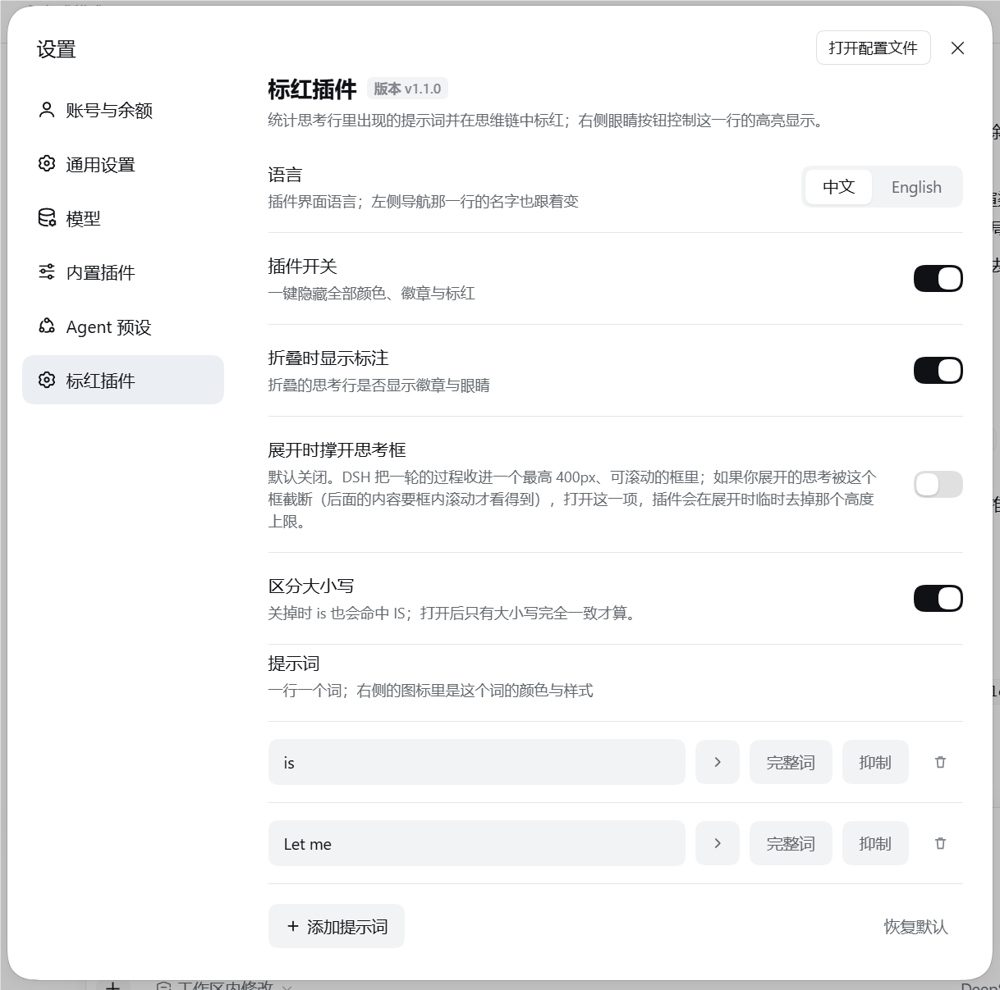

# 标红插件 · Thinking Highlighter

[English →](README.md)

DSH 插件：统计思考行（思维链）里关键词出现的次数并按词标红，设置在左侧有独立分区。


- **计数徽章**：每条思考行的标题行上、紧挨着标题显示 `关键词 × n`，一个词一个徽章，一眼看出哪个词反复出现、出现几次。
- **点徽章 = 这个词的开关**：点一下，这个词在**所有行**里停止标红，徽章原地变成灰虚线（位置和计数都还在），再点一下恢复。
  状态会存进设置，刷新后仍然有效。
- **标红**：展开思考行后，命中的关键词以它自己的底色标出，文字颜色和字号也可以单独设。
- **每个词自己的样式**：底色、文字颜色（默认「跟随」＝用正文色，深浅主题切换都不会看不清）、字号（10–22px，
  与 DSH 正文的字号范围一致）、字体（默认 / 等宽 / 衬线）、加粗、斜体、下划线——正文里的标红和徽章一起变，
  徽章的大小也跟着这个词的字号走。
- **完整词**：按词开关。开了以后 `is` 只匹配独立成词的位置，不再命中 `this` 或 `ThisIs`。
- **折叠时统计整段推理**：折叠与展开时的数字一致，不会只数那一行预览。
- **逐行眼睛**：单独隐藏某一行的标红，不影响其它行。关闭时标记仍留在文本里，只是被样式收起（底色、文字颜色、字号和这个词自己的字体/加粗/斜体/下划线一起），所以再点一下是**立刻恢复**，也不会漏掉别的词。
- **一个词只有一条**：输入已存在的词会被拒绝，并说明原因。

## 安装

网页版（`dsh web`）和桌面端都能装。按你的用法挑一条：

```bash
# 网页版，从 npm 装（直接装进 web profile）
dsh plugin --profile web add @yokira404/dsh-thinking-highlight

# 其它 profile 名
dsh plugin --profile desktop add @yokira404/dsh-thinking-highlight
```

刷新页面（桌面端重启应用）就能在设置里看到。装了 [dsh-market](https://github.com/dsh-market/dsh-market)
的话，就是市场里那张卡片，点一下装好。

用源码检出安装（不打 npm）：

```bash
git clone https://github.com/Yokira404/dsh-thinking-highlight.git
cd dsh-thinking-highlight
node evidence/install.mjs desktop        # 或传入其它 profile 名
```

安装脚本会在 profile 的 `package.json` 里写一条指向本目录的 **`link:` 依赖**、把包加进 `dsh.profile.bundles`，
并在 `<profile>/node_modules` 下建一个 junction。之后**重启应用**：侧边栏「插件 → 已安装」里会出现卡片，
卡片右侧的开关即整体启停。

`dsh plugin add` 自己就会做前两步——本地目录、tarball、npm 包名都一样。

> 依赖那一条不能省：插件页只列 profile 记成**依赖**（或随安装提供的官方可选包）的组合包。只写进
> `dsh.profile.bundles` 的包照常加载，但不会出现卡片，也就没有开关。

### 环境要求

- 有 `web` profile 的 `dsh`（`dsh web` 0.1.0-rc.6 以上，这也是 dsh-market 自己的门槛）。
- 不需要装任何宿主包：插件只 import `react` 和 `react-dom/client`，这两个由宿主的浏览器半边提供。
  它没有声明 `@deepseek-ai/*` 依赖，也没有 `engines` 区间，所以不限制你跑哪个版本的 harness。
- 它装饰的思考行（`[data-variant="think"]`）在 dsh desktop 0.2.0-rc.2 和 `dsh web` 自带的
  `@deepseek-ai/dsh-client-ui-chat` 里都存在；`evidence/host-shape.mjs` 会断言它依赖的那几个标记
  仍在安装版的 bundle 里。

## 设置

`Ctrl + ,` → 左侧导航 **标红插件 / Thinking Highlighter**。



| 行 | 作用 |
|---|---|
| 语言 | 插件界面语言（中文 / English）；左侧导航那一行的名字也跟着变 |
| 插件开关 | 一键隐藏全部颜色、徽章与标红 |
| 折叠时显示标注 | 折叠的思考行是否显示徽章与眼睛 |
| 展开时撑开思考框（默认关） | DSH 把一轮的过程收进一个最高 400px 的可滚动框里；打开这一项后，有行展开期间插件会临时去掉这个高度上限，长思维链不用在框内滚动就能读完 |
| 区分大小写 | 关掉（默认）时 `is` 也会命中 `IS` |
| 关键词（每行） | `关键词输入框` `▸样式` `完整词` `抑制` `删除` |
| ▸ 样式面板 | 这个词的**底色**、**文字颜色**（「跟随」＝交还给主题）、**字号**（10–22px 步进器，与 DSH 正文同一区间）、字体、**B** 加粗、**I** 斜体、**U** 下划线 |

设置存在浏览器本地（`localStorage`），改动即时生效。

## 实现要点

思考行是内置组件、没有对外插槽，所以装饰走**渲染后的 DOM**——只切分文本节点，从不替换 React 的节点：

- 标红时把 React 自己那个文本节点的值清空，在它前面插入插件新建的 span。React 之后写回的仍是同一个节点，
  因此流式输出不崩、不丢字。唯一看得见的接缝：React 把新一段写进那个节点之后、插件下一趟处理之前（最多一个
  90 ms 的合并窗口），上一版的切分副本和新全文会同时留在 DOM 里，那一趟会把旧副本丢掉并重新标红新文本。
- 变更按 90 ms 合并；行文本与设置都没变就整行跳过。
- 徽章插在**标题那一行本身**（`[data-open] > [data-disclosure-row] > 内容行`），标题与它的分隔点之后、
  折叠预览之前：折叠时整个头部是固定高度的盒子，挂在块级层上会掉到行下面去。头部块靠它的
  `[data-disclosure-row]` 那一行来找，而不是靠「行的第一个子元素」：模型还在流式输出时，宿主会在头部块
  **之前**渲染一个视觉隐藏的「正在思考」状态 span，徽章落进那个 1px 盒子就等于没人看得见。
- 展开的思维链在**披露块内部**、紧跟标题行之后找（`DisclosureRow` 就是这么渲染的：`[div[data-disclosure-row],
  open && children]`）。已经完结、从未在流式中被看到过的行也必须这样找得到，否则展开它永远不会上色。
- 徽章组**完全不参与收缩**（旁边的折叠预览是 `flex: auto`），所以它有定宽上限、只裁自己。
- 计数用的文本**只排除徽章组**，高亮 span 要算进来：两者都带标记，一律排除会让数字在第一次标红后掉到 0，
  连徽章一起消失；反过来连徽章一起数，就是自己数自己，数字每轮往上爬一格。
- 逐行眼睛是**显示开关，不是工作开关**：关闭期间这一行照样保留标记（由 `[data-dsh-hl="off"]` 把它们收起），
  所以关闭时点徽章静音、继续流式、或宿主重渲染，都不会让重新打开眼睛时「无标可显」。
- 没设文字颜色的词，标记写的是 `color: currentColor` 而不是某个固定色值：这样「跟随主题」不需要第二条代码路径，
  上面那条收起规则也有一个继承来的值可以还回去。
- 徽章的大小走挂在徽章元素上的 `--dsh-th-chip-scale` 系数，行高比字号涨得慢，并且用 `--dsh-th-chip-line`
  封顶——那个值由客户端从宿主自己的 `--dsh-content-font-delta` 算出来：折叠行的标题行是宿主用 `contain: size
  layout` 钉死的固定高度，徽章涨过头只会被裁掉，看不见。该变量发布在 `body` 上，所以上限只能在装饰时算：
  只有文档内的节点才读得到它，而插件没有任何一条规则是挂在 `body` 上的。
- 折叠行没有正文可数：宿主只在展开时挂载思维链，整段文字活在宿主组件的 `text` 属性上。插件顺着 React 挂在
  每个节点上的 fiber（`__reactFiber$…`）往上找到它；任何意外情况（没有 fiber、属性改名、换 React）都读作
  「拿不到」，退回只用 DOM 文字。

## 兼容性与已知取舍

- 插件按当前 DSH 渲染出的 `[data-variant="think"]` 行来装饰。DSH 若改动这些内部结构，这里可能需要跟着改；
  查找失败时插件只会「少做一点」，不会把对话弄坏。`evidence/host-shape.mjs` 按安装版的真实结构建模，并顺带
  断言它依赖的那几个标记仍然存在于应用自己的 bundle 里——DSH 改名会变成一条失败的测试，而不是安静地不工作。
- 字号区间（10–22px）不是我定的，是抄宿主主题插件的正文尺寸定义（`min(10).max(22).default(14)`）：插件里量不到
  宿主的 schema，所以 `host-shape.mjs` 也断言这两个数字仍在那份 bundle 里——DSH 改了区间，会先有一条测试失败。
- 抑制是按**关键词**生效的（同一个词在所有行一起停），逐行控制是那只眼睛。
- 四个设置里只有「展开时撑开思考框」会碰宿主布局，所以它默认关闭。
- 设置存在本机浏览器里。另一个窗口改了设置，会通过浏览器的 `storage` 事件传过来，插件重新读一遍并重建每一行。

## 开发

```bash
node evidence/selftest.mjs         #  62 项：切分/还原/计数/大小写/颜色/字号/完整词边界
node evidence/client-harness.mjs   # 136 项：浏览器半边在桩宿主里真的跑起来
node evidence/css-check.mjs        #  26 项：样式表字面量（括号、徽章/行/面板规则）
node evidence/locale-check.mjs     #   9 项：包 meta、两个语言文件与版本号互相对得上
node evidence/host-shape.mjs       #  27 项：安装版的真实行结构与正文字号区间，以及它在应用 bundle 里的标记
node evidence/e2e-bundle.mjs <带 token 的页面地址> @yokira404/dsh-thinking-highlight <cookie>
```

自检用大括号配对从 `client.js` 里**抽出真正在跑的函数**（不是副本）跑在 DOM 桩上；harness 则真的执行
factory、`apply`、设置页组件和一次完整的思考行装饰。它们针对的都是安静出错的坑：模板字符串丢了尾巴、
计数把自己数进去、缓存让标红再也回不来。

`host-shape.mjs` 是唯一按**宿主真正渲染的 DOM** 建模的套件（含流式期间那个视觉隐藏的状态 span、嵌在披露块
内部的正文）：用插件自己的假设搭出来的桩，抓不到假设本身错在哪。找不到应用安装时，它的 bundle 检查会打印
SKIP 而不是失败。

`e2e-bundle.mjs` 对着一个跑起来的临时 profile 做端到端校验：Host 行真的激活、启动清单带上浏览器半边、
下发的 bundle 与 `client.js` **逐字节一致（sha256）**。

| 文件 | 作用 |
|---|---|
| `package.json` | bundle 清单：`dsh.bundle.patch` + `dsh.client`（`platform: web`） |
| `cordis.patch.yml` | 往 profile 里插入 `thinking-highlight` 行 |
| `index.js` | Host 半边：让包可加载并发布 `dsh.client` |
| `client.js` | 浏览器半边：设置分区 + 思考行装饰 |
| `locale/*.json` | 卡片标题与描述，必须是 `{"meta": {...}}` |
| `icon.svg` | 插件图标 |
| `docs/` | 上面那几张截图 |

运行期可以在控制台用 `window.__DSH_TH__`：`settings()`、`rows()`（`{ highlighted, count, hasBadges, marked,
folded }`）、`refresh()`、`clear()`、`pass()`、`passes()`、`diagnose()`。

`diagnose()` 是给这种情况用的：插件显然加载了（设置页都在），偏偏徽章不出来。它会打开一个页面状态探针，
回答其它接口答不了的那个问题——**插件在这个页面上到底有没有看到思考行**。它会返回当前计数；刷新页面后，
每一趟 pass 都会把看到的东西写进 `localStorage['dsh-thinking-highlight.state.probe']`：存下来的设置、
最后一趟的行数与词数，以及每一行的记录（计数、徽章在不在、标记是否还在文档里、是否折叠、是否展开）。
默认关闭，因为它每趟都会写；`diagnose(false)` 可以关回去。

## 卸载

插件页卡片上的**卸载**，或手动删掉 `link:` 依赖、`node_modules/@yokira404/dsh-thinking-highlight` junction
与 `dsh.profile.bundles` 里的条目。卸载会移除全部徽章、还原被切分的文本节点、撤掉插件样式，并把
`dsh-th-body` 这个标记 class 从宿主元素上摘掉。

## 许可

[MIT](LICENSE) © 2026 Yokira404
